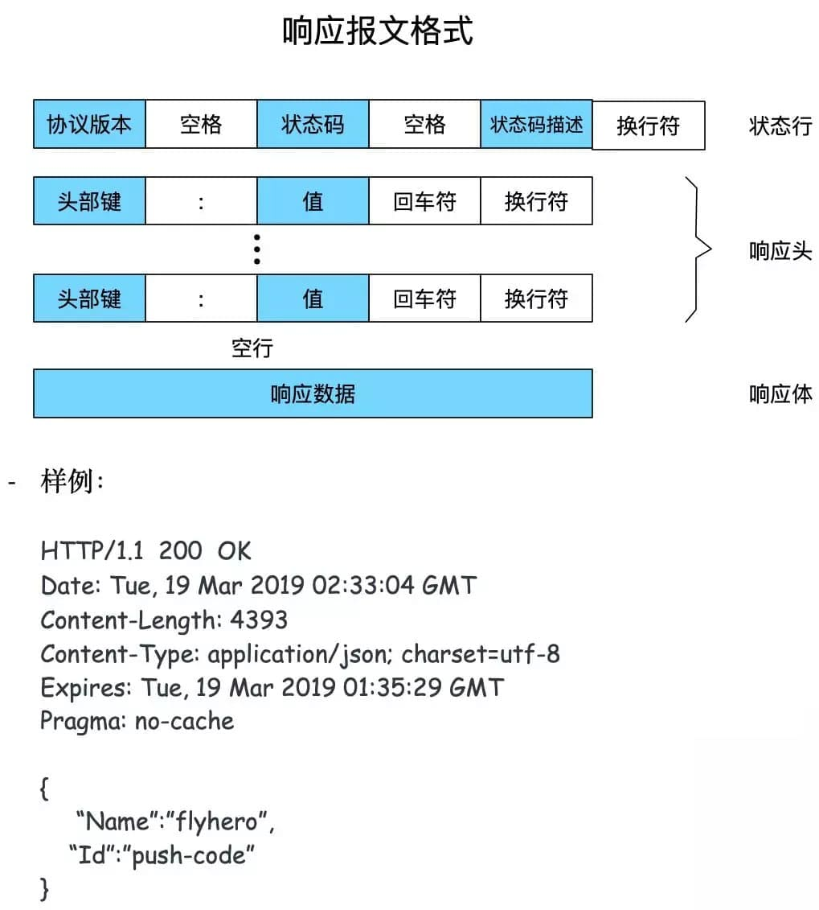
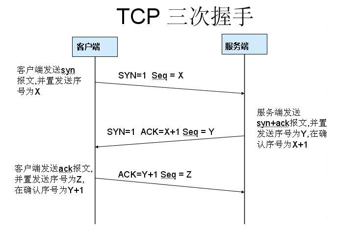

# http, https/2, https, TCP

### 问题：简单讲解一下 http2 的多路复用

HTTP2采用二进制格式传输，取代了HTTP1.x的文本格式，二进制格式解析更高效。
多路复用代替了HTTP1.x的序列和阻塞机制，所有的相同域名请求都通过同一个TCP连接并发完成。在HTTP1.x中，并发多个请求需要多个TCP连接，浏览器为了控制资源会有6-8个TCP连接都限制。
HTTP2中

- 同域名下所有通信都在单个连接上完成，消除了因多个 TCP 连接而带来的延时和内存消耗。
- 单个连接上可以并行交错的请求和响应，之间互不干扰

## http

HTTP（超文本传输协议）是一种可扩展的协议，无状态的。它是应用层的协议，通过[TCP](https://developer.mozilla.org/en-US/docs/Glossary/TCP)，或者是`TLS`加密的TCP连接来发送，理论上任何可靠的传输协议都可以使用。

**无状态**

在同一个连接中，两个执行成功的请求之间是没有关系的。这就带来了一个问题，用户没有办法在同一个网站中进行连续的交互，比如在一个电商网站里，用户把某个商品加入到购物车，切换一个页面后再次添加了商品，这两次添加商品的请求之间没有关联，浏览器无法知道用户最终选择了哪些商品。而使用HTTP的头部扩展，HTTP Cookies就可以解决这个问题。把Cookies添加到头部中，创建一个会话让每次请求都能共享相同的上下文信息，达成相同的状态。

>  注意，HTTP本质是无状态的，使用Cookies可以创建有状态的会话。


### HTTP 缺点

#### 无状态

所谓的优点和缺点还是要分场景来看的，对于 HTTP 而言，最具争议的地方在于它的**无状态**。

在需要长连接的场景中，需要保存大量的上下文信息，以免传输大量重复的信息，那么这时候无状态就是 http 的缺点了。

但与此同时，另外一些应用仅仅只是为了获取一些数据，不需要保存连接上下文信息，无状态反而减少了网络开销，成为了 http 的优点。

#### 明文传输

即协议里的报文(主要指的是头部)不使用二进制数据，而是文本形式。

这当然对于调试提供了便利，但同时也让 HTTP 的报文信息暴露给了外界，给攻击者也提供了便利。`WIFI陷阱`就是利用 HTTP 明文传输的缺点，诱导你连上热点，然后疯狂抓你所有的流量，从而拿到你的敏感信息。

#### 队头阻塞问题

当 http 开启长连接时，共用一个 TCP 连接，同一时刻只能处理一个请求，那么当前请求耗时过长的情况下，其它的请求只能处于阻塞状态，也就是著名的**队头阻塞**问题。接下来会有一小节讨论这个问题。

### http报文

#### 请求（Request）

请求由以下元素组成：

- 请求行（http method，资源地址，http协议版本号）
- 请求头（http headers）
- 空行
- 请求体（发送的资源body）


#### 响应

响应报文包含了下面的元素：

- 状态行（http协议版本号，状态码，状态信息）
- 响应头（http headers）
- 空行
- 响应体（获取的资源body）



> 空行很重要，用来区分开`头部`和`实体`。 
>
> 如果说在头部中间故意加一个空行会怎么样？
>
> 那么空行后的内容全部被视为实体。实体也就是`body`部分。请求报文对应`请求体`, 响应报文对应`响应体`。

### 请求方法

`http/1.1`规定了以下请求方法:

- GET: 通常用来获取资源
- HEAD: 获取资源的元信息
- POST: 提交数据，即上传数据
- PUT: 修改数据
- DELETE: 删除资源(几乎用不到)
- CONNECT: 建立连接隧道，用于代理服务器
- OPTIONS: 列出可对资源实行的请求方法，用来跨域请求
- TRACE: 追踪请求-响应的传输路径

#### GET 和 POST 有什么区别？

首先最直观的是语义上的区别。

而后又有这样一些具体的差别:

- 从**缓存**的角度，GET 请求会被浏览器主动缓存下来，留下历史记录，而 POST 默认不会。
- 从**编码**的角度，GET 只能进行 URL 编码，只能接收 ASCII 字符，而 POST 没有限制。
- 从**参数**的角度，GET 一般放在 URL 中，因此不安全，POST 放在请求体中，更适合传输敏感信息。
- 从**幂等性**的角度，`GET`是**幂等**的，而`POST`不是。(`幂等`表示执行相同的操作，结果也是相同的)
- 从**TCP**的角度，GET 请求会把请求报文一次性发出去，而 POST 会分为两个 TCP 数据包，首先发 header 部分，如果服务器响应 100(continue)， 然后发 body 部分。(**火狐**浏览器除外，它的 POST 请求只发一个 TCP 包)


### http状态码

RFC 规定 HTTP 的状态码为**三位数**，被分为五类:

- **1xx**: 表示目前是协议处理的中间状态，还需要后续操作。
- **2xx**: 表示成功状态。
- **3xx**: 重定向状态，资源位置发生变动，需要重新请求。
- **4xx**: 请求报文有误。
- **5xx**: 服务器端发生错误。

接下来就一一分析这里面具体的状态码。

#### 1xx

**101 Switching Protocols**。在`HTTP`升级为`WebSocket`的时候，如果服务器同意变更，就会发送状态码 101。

#### 2xx

**200 OK**是见得最多的成功状态码。通常在响应体中放有数据。

**204 No Content**含义与 200 相同，但响应头后没有 body 数据。

**206 Partial Content**顾名思义，表示部分内容，它的使用场景为 HTTP 分块下载和断点续传，当然也会带上相应的响应头字段`Content-Range`。

#### 3xx

**301 Moved Permanently**即永久重定向，对应着**302 Found**，即临时重定向。

比如你的网站从 HTTP 升级到了 HTTPS 了，以前的站点再也不用了，应当返回`301`，这个时候浏览器默认会做缓存优化，在第二次访问的时候自动访问重定向的那个地址。

而如果只是暂时不可用，那么直接返回`302`即可，和`301`不同的是，浏览器并不会做缓存优化。

**304 Not Modified**: 当协商缓存命中时会返回这个状态码。详见[浏览器缓存](http://47.98.159.95/my_blog/perform/001.html)

#### 4xx

**400 Bad Request**: 开发者经常看到一头雾水，只是笼统地提示了一下错误，并不知道哪里出错了。

**403 Forbidden**: 这实际上并不是请求报文出错，而是服务器禁止访问，原因有很多，比如法律禁止、信息敏感。

**404 Not Found**: 资源未找到，表示没在服务器上找到相应的资源。

**405 Method Not Allowed**: 请求方法不被服务器端允许。

**406 Not Acceptable**: 资源无法满足客户端的条件。

**408 Request Timeout**: 服务器等待了太长时间。

**409 Conflict**: 多个请求发生了冲突。

**413 Request Entity Too Large**: 请求体的数据过大。

**414 Request-URI Too Long**: 请求行里的 URI 太大。

**429 Too Many Request**: 客户端发送的请求过多。

**431 Request Header Fields Too Large**请求头的字段内容太大。

#### 5xx

**500 Internal Server Error**: 仅仅告诉你服务器出错了，出了啥错咱也不知道。

**501 Not Implemented**: 表示客户端请求的功能还不支持。

**502 Bad Gateway**: 服务器自身是正常的，但访问的时候出错了，啥错误咱也不知道。

**503 Service Unavailable**: 表示服务器当前很忙，暂时无法响应服务。


[见https://github.com/moshang-xc/Blog/issues/7](https://github.com/moshang-xc/Blog/issues/7)

### 对于定长和不定长的数据，HTTP 是怎么传输的

#### 定长包体

对于定长包体而言，发送端在传输的时候一般会带上 `Content-Length`, 来指明包体的长度。

我们用一个`nodejs`服务器来模拟一下:

```js
const http = require('http');

const server = http.createServer();

server.on('request', (req, res) => {
  if(req.url === '/') {
    res.setHeader('Content-Type', 'text/plain');
    res.setHeader('Content-Length', 10);
    res.write("helloworld");
  }
})

server.listen(8081, () => {
  console.log("成功启动");
})
```

启动后访问: **localhost:8081**。

浏览器中显示如下:

```
helloworld
```

这是长度正确的情况，那不正确的情况是如何处理的呢？

我们试着把这个长度设置的小一些:

```js
res.setHeader('Content-Length', 8);
```

重启服务，再次访问，现在浏览器中内容如下:

```
hellowor
```

那后面的`ld`哪里去了呢？实际上在 http 的响应体中直接被截去了。

然后我们试着将这个长度设置得大一些:

```js
res.setHeader('Content-Length', 12);
```

此时浏览器显示如下:

```
 无法正常运行
```

直接无法显示了。可以看到`Content-Length`对于 http 传输过程起到了十分关键的作用，如果设置不当可以直接导致传输失败。

#### 不定长包体

上述是针对于`定长包体`，那么对于`不定长包体`而言是如何传输的呢？

这里就必须介绍另外一个 http 头部字段了:

```js
Transfer-Encoding: chunked
```

表示分块传输数据，设置这个字段后会自动产生两个效果:

- Content-Length 字段会被忽略
- 基于长连接持续推送动态内容

我们依然以一个实际的例子来模拟分块传输，nodejs 程序如下:

```js
const http = require('http');

const server = http.createServer();

server.on('request', (req, res) => {
  if(req.url === '/') {
    res.setHeader('Content-Type', 'text/html; charset=utf8');
    res.setHeader('Content-Length', 10);
    res.setHeader('Transfer-Encoding', 'chunked');
    res.write("<p>来啦</p>");
    setTimeout(() => {
      res.write("第一次传输<br/>");
    }, 1000);
    setTimeout(() => {
      res.write("第二次传输");
      res.end()
    }, 2000);
  }
})

server.listen(8009, () => {
  console.log("成功启动");
})
```

### HTTP 如何处理大文件的传输？

对于几百 M 甚至上 G 的大文件来说，如果要一口气全部传输过来显然是不现实的，会有大量的等待时间，严重影响用户体验。因此，HTTP 针对这一场景，采取了`范围请求`的解决方案，允许客户端仅仅请求一个资源的一部分。

#### 如何支持

当然，前提是服务器要支持**范围请求**，要支持这个功能，就必须加上这样一个响应头:

```
Accept-Ranges: none
```

用来告知客户端这边是支持范围请求的。

#### Range 字段拆解

而对于客户端而言，它需要指定请求哪一部分，通过`Range`这个请求头字段确定，格式为`bytes=x-y`。接下来就来讨论一下这个 Range 的书写格式:

- **0-499**表示从开始到第 499 个字节。
- **500**- 表示从第 500 字节到文件终点。
- **-100**表示文件的最后100个字节。

服务器收到请求之后，首先验证范围**是否合法**，如果越界了那么返回`416`错误码，否则读取相应片段，返回`206`状态码。

同时，服务器需要添加`Content-Range`字段，这个字段的格式根据请求头中`Range`字段的不同而有所差异。

具体来说，请求`单段数据`和请求`多段数据`，响应头是不一样的。

举个例子:

```
// 单段数据
Range: bytes=0-9
// 多段数据
Range: bytes=0-9, 30-39

```

接下来我们就分别来讨论着两种情况。

#### 单段数据

对于`单段数据`的请求，返回的响应如下:

```
HTTP/1.1 206 Partial Content
Content-Length: 10
Accept-Ranges: bytes
Content-Range: bytes 0-9/100

i am xxxxx
```

值得注意的是`Content-Range`字段，`0-9`表示请求的返回，`100`表示资源的总大小，很好理解。

#### 多段数据

接下来我们看看多段请求的情况。得到的响应会是下面这个形式:

```
HTTP/1.1 206 Partial Content
Content-Type: multipart/byteranges; boundary=00000010101
Content-Length: 189
Connection: keep-alive
Accept-Ranges: bytes


--00000010101
Content-Type: text/plain
Content-Range: bytes 0-9/96

i am xxxxx
--00000010101
Content-Type: text/plain
Content-Range: bytes 20-29/96

eex jspy e
--00000010101--
```

这个时候出现了一个非常关键的字段`Content-Type: multipart/byteranges;boundary=00000010101`，它代表了信息量是这样的:

- 请求一定是多段数据请求
- 响应体中的分隔符是 00000010101

因此，在响应体中各段数据之间会由这里指定的分隔符分开，而且在最后的分隔末尾添上`--`表示结束。

以上就是 http 针对大文件传输所采用的手段。

### HTTP 中如何处理表单数据的提交？ 	

在 http 中，有两种主要的表单提交的方式，体现在两种不同的`Content-Type`取值:

- application/x-www-form-urlencoded
- multipart/form-data

由于表单提交一般是`POST`请求，很少考虑`GET`，因此这里我们将默认提交的数据放在请求体中。

#### application/x-www-form-urlencoded

对于`application/x-www-form-urlencoded`格式的表单内容，有以下特点:

- 其中的数据会被编码成以`&`分隔的键值对
- 字符以**URL编码方式**编码。

如：

```
// 转换过程: {a: 1, b: 2} -> a=1&b=2 -> 如下(最终形式)
"a%3D1%26b%3D2"
复制代码
```

#### multipart/form-data

对于`multipart/form-data`而言:

- 请求头中的`Content-Type`字段会包含`boundary`，且`boundary`的值有浏览器默认指定。例: `Content-Type: multipart/form-data;boundary=----WebkitFormBoundaryRRJKeWfHPGrS4LKe`。
- 数据会分为多个部分，每两个部分之间通过分隔符来分隔，每部分表述均有 HTTP 头部描述子包体，如`Content-Type`，在最后的分隔符会加上`--`表示结束。

相应的`请求体`是下面这样:

```
Content-Disposition: form-data;name="data1";
Content-Type: text/plain
data1
----WebkitFormBoundaryRRJKeWfHPGrS4LKe
Content-Disposition: form-data;name="data2";
Content-Type: text/plain
data2
----WebkitFormBoundaryRRJKeWfHPGrS4LKe--
复制代码
```

#### 小结

值得一提的是，`multipart/form-data` 格式最大的特点在于:**每一个表单元素都是独立的资源表述**。另外，你可能在写业务的过程中，并没有注意到其中还有`boundary`的存在，如果你打开抓包工具，确实可以看到不同的表单元素被拆分开了，之所以在平时感觉不到，是以为浏览器和 HTTP 给你封装了这一系列操作。

而且，在实际的场景中，对于图片等文件的上传，基本采用`multipart/form-data`而不用`application/x-www-form-urlencoded`，因为没有必要做 URL 编码，带来巨大耗时的同时也占用了更多的空间。

## http历史

### http0.9

HTTP 的最早版本诞生在 1991 年，这个最早版本和现在比起来极其简单，没有 HTTP 头，没有状态码，甚至版本号也没有，后来它的版本号才被定为 0.9 来和其他版本的 HTTP 区分。HTTP/0.9 只支持一种方法—— Get，请求只有一行。

```
GET /hello.html
```

响应也是非常简单的，只包含 html 文档本身。

```
<HTML>
Hello world
</HTML>
```

当 TCP 建立连接之后，服务器向客户端返回 HTML 格式的字符串。发送完毕后，就关闭 TCP 连接。由于没有状态码和错误代码，如果服务器处理的时候发生错误，只会传回一个特殊的包含问题描述信息的 HTML 文件。这就是最早的 HTTP/0.9 版本。

### http1.0

相比 HTTP/0.9，HTTP/1.0 主要有如下特性：

- 请求与响应支持 HTTP 头，增加了状态码，响应对象的一开始是一个响应状态行
- 协议版本信息需要随着请求一起发送，支持 HEAD，POST 方法
- 支持传输 HTML 文件以外其他类型的内容

一个典型的 HTTP/1.0 的请求像这样：

```php
GET /hello.html HTTP/1.0
User-Agent:NCSA_Mosaic/2.0(Windows3.1)

200 OK
Date: Tue, 15 Nov 1996 08:12:31 GMT
Server: CERN/3.0 libwww/2.17
Content-Type: text/html

<html>
一个包含图片的页面
<IMGSRC="/smile.gif">
</html>
```

### http1.1

HTTP/1.1 更多的是作为对 HTTP/1.0 的完善，在 HTTP1.1 中，主要具有如下改进：

- **HTTP 1.1支持长连接（PersistentConnection）**

HTTP 1.0规定浏览器与服务器只保持短暂的连接，浏览器的每次请求都需要与服务器建立一个TCP连接，服务器完成请求处理后立即断开TCP连接，服务器不跟踪每个客户也不记录过去的请求。
	HTTP 1.1则支持持久连接Persistent Connection, 并且默认使用persistent  connection. 在同一个tcp的连接中可以传送多个HTTP请求和响应. 多个请求和响应可以重叠，多个请求和响应可以同时进行. HTTP 1.1的持续连接，也需要增加新的请求头来帮助实现，例如，Connection请求头的值为**Keep-Alive**时，客户端通知服务器返回本次请求结果后保持连接；Connection请求头的值为close时，客户端通知服务器返回本次请求结果后关闭连接。

- **请求的流水线（Pipelining）处理**

请求的流水线（Pipelining）处理，在一个TCP连接上可以传送多个HTTP请求和响应，减少了建立和关闭连接的消耗和延迟。例如：一个包含有许多图像的网页文件的多个请求和应答可以在一个连接中传输，但每个单独的网页文件的请求和应答仍然需要使用各自的连接。  HTTP 1.1还允许客户端不用等待上一次请求结果返回，就可以发出下一次请求，但服务器端必须按照接收到客户端请求的先后顺序依次回送响应结果，以保证客户端能够区分出每次请求的响应内容。

> 注意：这个pipelining仅仅是限于理论场景下，大部分桌面浏览器仍然会选择默认关闭HTTP pipelining！所以现在使用HTTP1.1协议的应用，都是有可能会开多个TCP连接的！

- **HTTP 1.1增加host字段**

在HTTP1.0中认为每台服务器都绑定一个唯一的IP地址，因此，请求消息中的URL并没有传递主机名（hostname）。但随着虚拟主机技术的发展，在一台物理服务器上可以存在多个虚拟主机（Multi-homed Web Servers），并且它们共享一个IP地址。

HTTP1.1的请求消息和响应消息都应支持Host头域，且请求消息中如果没有Host头域会报告一个错误（400 Bad Request）。此外，服务器应该接受以绝对路径标记的资源请求。

- **错误通知的管理**

在HTTP1.1中新增了24个错误状态响应码，如409（Conflict）表示请求的资源与资源的当前状态发生冲突；410（Gone）表示服务器上的某个资源被永久性的删除。

HTTP/1.1加入了一个新的状态码100（Continue）。客户端事先发送一个只带头域的请求，如果服务器因为权限拒绝了请求，就回送响应码401（Unauthorized）；如果服务器接收此请求就回送响应码100，客户端就可以继续发送带实体的完整请求了。100 (Continue) 状态代码的使用，允许客户端在发request消息body之前先用request header试探一下server，看server要不要接收request body，再决定要不要发request body。

- **带宽优化及网络连接的使用**

HTTP/1.1中引入了Chunked transfer-coding来解决上面这个问题，发送方将消息分割成若干个任意大小的数据块，每个数据块在发送时都会附上块的长度，最后用一个零长度的块作为消息结束的标志。这种方法允许发送方只缓冲消息的一个片段，避免缓冲整个消息带来的过载。

- **缓存处理**

HTTP/1.1在1.0的基础上加入了一些cache的新特性，当缓存对象的Age超过Expire时变为stale对象，cache不需要直接抛弃stale对象，而是与源服务器进行重新激活（revalidation）。

- 新增了 OPTIONS,PUT, DELETE, TRACE, CONNECT 方法

### HTTP1.1 如何解决 HTTP 的队头阻塞问题？

#### 什么是 HTTP 队头阻塞？

从前面的小节可以知道，HTTP 传输是基于`请求-应答`的模式进行的，报文必须是一发一收，但值得注意的是，里面的任务被放在一个任务队列中串行执行，一旦队首的请求处理太慢，就会阻塞后面请求的处理。这就是著名的`HTTP队头阻塞`问题。

#### 并发连接

对于一个域名允许分配多个长连接，那么相当于增加了任务队列，不至于一个队伍的任务阻塞其它所有任务。在RFC2616规定过客户端最多并发 2 个连接，不过事实上在现在的浏览器标准中，这个上限要多很多，Chrome 中是 6 个。

但其实，即使是提高了并发连接，还是不能满足人们对性能的需求。

#### 域名分片

一个域名不是可以并发 6 个长连接吗？那我就多分几个域名。

比如 content1.sanyuan.com 、content2.sanyuan.com。

这样一个`sanyuan.com`域名下可以分出非常多的二级域名，而它们都指向同样的一台服务器，能够并发的长连接数更多了，事实上也更好地解决了队头阻塞的问题。


### http2

HTTP 1.1提出了管线化(pipelining)理论，但是仅仅是限于理论的阶段上，这个功能默认还是关闭了的。

管线化(pipelining)和非管线化的**区别**：

- HTTP Pipelining其实是把多个HTTP请求放到一个TCP连接中一一发送，而在发送过程中不需要等待服务器对前一个请求的响应；只不过，**客户端还是要按照发送请求的顺序来接收响应！**

就像在超市收银台或者银行柜台排队时一样，你并不知道前面的**顾客**是干脆利索的还是会跟收银员/柜员磨蹭到世界末日（不管怎么说，服务器（即收银员/柜员）是要按照顺序处理请求的，如果**前一个请求非常耗时（顾客磨蹭）**，那么后续请求都会受到影响。

- 在HTTP1.0中，发送一次请求时，需要**等待服务端响应了**才可以继续发送请求。
- 在HTTP1.1中，发送一次请求时，不需要等待服务端响应了就可以发送请求了，但是回送数据给客户端的时候，客户端还是需要按照**响应的顺序**来一一接收

所以说，无论是HTTP1.0还是HTTP1.1提出了Pipelining理论，还是会出现**阻塞**的情况。从专业的名词上说这种情况，叫做**线头阻塞**（Head of line blocking）简称：HOLB

HTTP2与HTTP1.1最重要的区别就是**解决了线头阻塞的**问题！其中最重要的改动是：**多路复用 (Multiplexing)**

### HTTP1.0和1.1现存的一些问题

1. 上面提到过的，HTTP1.x在传输数据时，每次都需要重新建立连接，无疑增加了大量的延迟时间，特别是在移动端更为突出。
2.  HTTP1.x在传输数据时，所有传输的内容都是明文，客户端和服务器端都无法验证对方的身份，这在一定程度上无法保证数据的安全性。
3.  HTTP1.x在使用时，header里携带的内容过大，在一定程度上增加了传输的成本，并且每次请求header基本不怎么变化，尤其在移动端增加用户流量。
4.  虽然HTTP1.x支持了keep-alive，来弥补多次创建连接产生的延迟，但是keep-alive使用多了同样会给服务端带来大量的性能压力，并且对于单个文件被不断请求的服务(例如图片存放网站)，keep-alive可能会极大的影响性能，因为它在文件被请求之后还保持了不必要的连接很长时间。

#### http2特性

- **http2是一个二进制协议。**

- **二进制格式**

  HTTP1.x的解析是基于文本。基于文本协议的格式解析存在天然缺陷，文本的表现形式有多样性，要做到健壮性考虑的场景必然很多，二进制则不同，只认0和1的组合。基于这种考虑HTTP2.0的协议解析决定采用二进制格式，实现方便且健壮。

- **多路复用**

  即连接共享，即每一个request都是是用作连接共享机制的。一个request对应一个id，这样一个连接上可以有多个request，每个连接的request可以随机的混杂在一起，接收方可以根据request的 id将request再归属到各自不同的服务端请求里面。

  

  http2连接上传输的每个帧都关联到一个“流”。流是一个独立的，双向的帧序列可以通过一个http2的连接在服务端与客户端之间不断的交换数据。

  每个单独的http2连接都可以包含多个并发的流，这些流中交错的包含着来自两端的帧。流既可以被客户端/服务器端单方面的建立和使用，也可以被双方共享，或者被任意一边关闭。在流里面，每一帧发送的顺序非常关键。接收方会按照收到帧的顺序来进行处理。

- **优先级和依赖性**

  每个流都包含一个优先级（也就是“权重”），它被用来告诉对端哪个流更重要。当资源有限的时候，服务器会根据优先级来选择应该先发送哪些流。

  借助于PRIORITY帧，客户端同样可以告知服务器当前的流依赖于其他哪个流。该功能让客户端能建立一个优先级“树”，所有“子流”会依赖于“父流”的传输完成情况。

  优先级和依赖关系可以在传输过程中被动态的改变。这样当用户滚动一个全是图片的页面的时候，浏览器就能够指定哪个图片拥有更高的优先级。或者是在你切换标签页的时候，浏览器可以提升新切换到页面所包含流的优先级。

- **头压缩**

  如上文中所言，对前面提到过HTTP1.x的header带有大量信息，而且每次都要重复发送，HTTP2.0使用encoder来减少需要传输的header大小，通讯双方各自cache一份header fields表，既避免了重复header的传输，又减小了需要传输的大小。

- **重置 - 后悔药**

  HTTP 1.1的有一个缺点是：当一个含有确切值的Content-Length的HTTP消息被送出之后，你就很难中断它了。当然，通常你可以断开整个TCP链接（但也不总是可以这样），但这样导致的代价就是需要通过三次握手来重新建立一个新的TCP连接。

  一个更好的方案是只终止当前传输的消息并重新发送一个新的。在http2里面，我们可以通过发送RST_STREAM帧来实现这种需求，从而避免浪费带宽和中断已有的连接。

- **服务器推送**

  这个功能通常被称作“缓存推送”。主要的思想是：当一个客户端请求资源X，而服务器知道它很可能也需要资源Z的情况下，服务器可以在客户端发送请求前，主动将资源Z推送给客户端。这个功能帮助客户端将Z放进缓存以备将来之需。

  服务器推送需要客户端显式的允许服务器提供该功能。但即使如此，客户端依然能自主选择是否需要中断该推送的流。如果不需要的话，客户端可以通过发送一个RST_STREAM帧来中止。

- **流量控制**

  每个http2流都拥有自己的公示的流量窗口，它可以限制另一端发送数据。如果你正好知道SSH的工作原理的话，这两者非常相似。

  对于每个流来说，两端都必须告诉对方自己还有足够的空间来处理新的数据，而在该窗口被扩大前，另一端只被允许发送这么多数据。

  而只有数据帧会受到流量控制。
  
  

## https

### 加密算法

#### 对称加密(AES)

发送方和接收方需要持有同一把密钥，发送消息和接收消息均使用该密钥。相对于非对称加密，对称加密具有更高的加解密速度，但双方都需要事先知道密钥，密钥在传输过程中可能会被窃取，因此安全性没有非对称加密高。

#### 非对称加密(RSA)

接收方在发送消息前需要事先生成公钥和私钥，然后将公钥发送给发送方。发送放收到公钥后，将待发送数据用公钥加密，发送给接收方。接收到收到数据后，用私钥解密。

在这个过程中，公钥负责加密，私钥负责解密，数据在传输过程中即使被截获，攻击者由于没有私钥，因此也无法破解。

非对称加密算法的加解密速度低于对称加密算法，但是安全性更高。

#### 几个名词要理清

- RSA：非对称加密

- AES：对称加密 

- CA：权威认证机构 服务器在建站的时候 去CA认证机构认证 得到对应的数字签名 相当于身份证号 客户端每次安装浏览器的时候 都会下载最新的CA列表 这个列表有对应的数字签名和服务器IP一一对应的列表 这就是为什么我们自己搭建的localhost没法发https的原因 因为没法进行CA认证

- 数字证书：包含了数字签名跟RSA公钥

- 数字签名：保证数字证书一定是服务器传给客户端的 相当于服务器的身份证ID

- 对称密钥： 对数据进行加密的key

- 非对称密钥： （k1， k2） k1加密的数据 只有k2能解开 k1位非对称公钥 k2为非对称私钥

- 非对称公钥：RSA公钥 k1加密的数据 只有k2能解开

- 非对称私钥：RSA私钥 k1加密的数据 只有k2能解开

### https 原理

HTTPS在传输数据之前需要客户端（浏览器）与服务端（网站）之间进行一次握手，在握手过程中将确立双方加密传输数据的密码信息。TLS/SSL协议不仅仅是一套加密传输的协议，更是一件经过艺术家精心设计的艺术品，TLS/SSL中使用了非对称加密，对称加密以及HASH算法。握手过程的简单描述如下：

1. 浏览器将自己支持的一套加密规则发送给网站。

2. 网站从中选出一组加密算法与HASH算法，并将自己的身份信息以证书的形式发回给浏览器。证书里面包含了网站地址，加密公钥，以及证书的颁发机构等信息。

3. 客户端收到了服务器发来的数据包后，会做这么几件事情：

       1. 验证证书的合法性（颁发证书的机构是否合法，证书中包含的网站地址是否与正在访问的地址一致等），如果证书受信任，则浏览器栏里面会显示一个小锁头，否则会给出证书不受信的提示。

   2. 如果证书合法，或者客户端接受和信任了不合法的证书，则客户端就会随机产生**一串序列号**，使用服务器发来的**公钥进行加密**。这时候，一条返回的消息就基本就绪。

   3. 最后使用服务器挑选的HASH算法，将刚才的消息使用刚才的**序列号**进行加密，生成相应的消息**校验值**，与刚才的消息一同发还给服务器。

4. 服务器接受到客户端发来的消息后，会做这么几件事情：
      1. 使用私钥解密上面第3.2中公钥加密的消息，得到客户端产生的**随机序列号**。
      2. 使用该**随机序列号，对该消息进行加密**，验证得到的**校验值**是否与客户端发来的校验值一致。如果一致则说明消息未被篡改，可以信任。
      3. 最后，使用该随机序列号，加上之前第2步中选择的加密算法，加密一段握手消息，发还给客户端。同时HASH值也带上。

5. 客户端收到服务器端的消息后，接着做这么几件事情：
    1. 计算HASH值是否与发回的消息一致
       2. 检查消息是否为握手消息
6. 握手过程结束，之后所有的通信数据将由之前浏览器生成的**随机序列号**并利用对称加密算法进行加密。

参考链接：https://mp.weixin.qq.com/s/StqqafHePlBkWAPQZg3NrA

### Http与Https的区别：

> Http与Https的区别：

1. HTTP 的URL 以http:// 开头，而HTTPS 的URL 以https:// 开头
2. HTTP无需证书，而HTTPS 需要CA机构颁发的SSL证书
3. HTTP和HTTPS使用的是完全不同的连接方式，用的端口也不一样，前者是80，后者是443。
4. HTTP协议运行在TCP之上，所有传输的内容都是明文，HTTPS运行在SSL/TLS之上，SSL/TLS运行在TCP之上，所有传输的内容都经过加密的。
5. HTTPS可以有效的防止运营商劫持

# URI

**URI**, 全称为(Uniform Resource Identifier), 也就是**统一资源标识符**，它的作用很简单，就是区分互联网上不同的资源。

但是，它并不是我们常说的`网址`, 网址指的是`URL`, 实际上`URI`包含了`URN`和`URL`两个部分，由于 URL 过于普及，就默认将 URI 视为 URL 了。


## URI 编码

URI 只能使用`ASCII`, ASCII 之外的字符是不支持显示的，而且还有一部分符号是界定符，如果不加以处理就会导致解析出错。

因此，URI 引入了`编码`机制，将所有**非 ASCII 码字符**和**界定符**转为十六进制字节值，然后在前面加个`%`。

如，空格被转义成了`%20`，**三元**被转义成了`%E4%B8%89%E5%85%83`。


# TCP

## 三次握手



### 第一次握手

client 发送一个 **SYN(X)包** 给 server，然后等待 server 的 ACK 回复，进入 `SYN-SENT` 状态。p.s: SYN 为 synchronize 的缩写，ACK 为 acknowledgment 的缩写。

### 第二次握手

server 接收到 SYN(seq=J) 包后就返回一个 **ACK(X+1)包** 以及一个自己的 **SYN(Y)** 包，然后等待 client 的 ACK 回复，server 进入 `SYN-RECIVED` 状态。

### 第三次握手

client 接收到 server 发回的 ACK(X+1) 包后，进入 `ESTABLISHED` 状态。然后根据 server 发来的 SYN(Y) 包，返回给等待中的 server 一个 **ACK(Y+1)包**。等待中的 server 收到 ACK 回复，也把自己的状态设置为 `ESTABLISHED`。到此 TCP 三次握手完成，client 与 server 可以正常进行通信了。

##### 为什么要三次握手？

为了防止已失效的连接请求报文段突然又传送到了服务端，因而产生错误。

具体例子：“已失效的连接请求报文段”的产生在这样一种情况下：client发出的第一个连接请求报文段并没有丢失，而是在某个网络结点长时间的滞留了，以致延误到连接释放以后的某个时间才到达server。本来这是一个早已失效的报文段。但server收到此失效的连接请求报文段后，就误认为是client再次发出的一个新的连接请求。于是就向client发出确认报文段，同意建立连接。假设不采用“三次握手”，那么只要server发出确认，新的连接就建立了。由于现在client并没有发出建立连接的请求，因此不会理睬server的确认，也不会向server发送数据。但server却以为新的运输连接已经建立，并一直等待client发来数据。这样，server的很多资源就白白浪费掉了。采用“三次握手”的办法可以防止上述现象发生。例如刚才那种情况，client不会向server的确认发出确认。server由于收不到确认，就知道client并没有要求建立连接。”


## 四次挥手

当客户端和服务器通过三次握手建立了TCP连接以后，当数据传送完毕，肯定是要断开TCP连接的啊。那对于TCP的断开连接，这里就有了神秘的“四次分手”。


### 第一次挥手

主机1（可以使客户端，也可以是服务器端），设置Sequence Number，向主机2发送一个FIN报文段；此时，主机1进入FIN_WAIT_1状态；这表示主机1没有数据要发送给主机2了；

### 第二次挥手

 主机2收到了主机1发送的FIN报文段，向主机1回一个ACK报文段，主机2进入 `CLOSE-WAIT` 状态；主机1进入`FIN_WAIT_2`状态；主机2告诉主机1，我“同意”你的关闭请求；

### 第三次挥手

主机2向主机1发送FIN报文段，请求关闭连接，同时主机2进入`LAST_ACK`状态；

### 第四次挥手

主机1收到主机2发送的FIN报文段，向主机2发送ACK报文段，然后主机1进入`TIME_WAIT`状态；主机2收到主机1的ACK报文段以后，就进入 `CLOSE` 状态，关闭连接；此时，主机1等待**`2MSL`**后依然没有收到回复，则证明Server端已正常关闭，那好，主机1也可以进入 `CLOSE` 状态，关闭连接了。

### 为什么要四次分手？

TCP协议是一种面向连接的、可靠的、基于字节流的运输层通信协议。TCP是全双工模式，这就意味着，当主机1发出FIN报文段时，只是表示主机1已经没有数据要发送了，主机1告诉主机2，它的数据已经全部发送完毕了；但是，这个时候主机1还是可以接受来自主机2的数据；当主机2返回ACK报文段时，表示它已经知道主机1没有数据发送了，但是主机2还是可以发送数据到主机1的；当主机2也发送了FIN报文段时，这个时候就表示主机2也没有数据要发送了，就会告诉主机1，我也没有数据要发送了，之后彼此就会愉快的中断这次TCP连接。

### 为什么要等待2MSL？

MSL：报文段最大生存时间，它是任何报文段被丢弃前在网络内的最长时间。
原因有二：

- 保证TCP协议的全双工连接能够可靠关闭
- 保证这次连接的重复数据段从网络中消失

第一点：如果主机1直接CLOSED了，那么由于IP协议的不可靠性或者是其它网络原因，导致主机2没有收到主机1最后回复的ACK。那么主机2就会在超时之后继续发送FIN，此时由于主机1已经CLOSED了，就找不到与重发的FIN对应的连接。所以，主机1不是直接进入CLOSED，而是要保持TIME_WAIT，当再次收到FIN的时候，能够保证对方收到ACK，最后正确的关闭连接。

第二点：如果主机1直接CLOSED，然后又再向主机2发起一个新连接，我们不能保证这个新连接与刚关闭的连接的端口号是不同的。也就是说有可能新连接和老连接的端口号是相同的。一般来说不会发生什么问题，但是还是有特殊情况出现：假设新连接和已经关闭的老连接端口号是一样的，如果前一次连接的某些数据仍然滞留在网络中，这些延迟数据在建立新连接之后才到达主机2，由于新连接和老连接的端口号是一样的，TCP协议就认为那个延迟的数据是属于新连接的，这样就和真正的新连接的数据包发生混淆了。所以TCP连接还要在TIME_WAIT状态等待2倍MSL，这样可以保证本次连接的所有数据都从网络中消失。


参考：

[HTTP灵魂之问，巩固你的 HTTP 知识体系](https://juejin.im/post/5e76bd516fb9a07cce750746#heading-74)